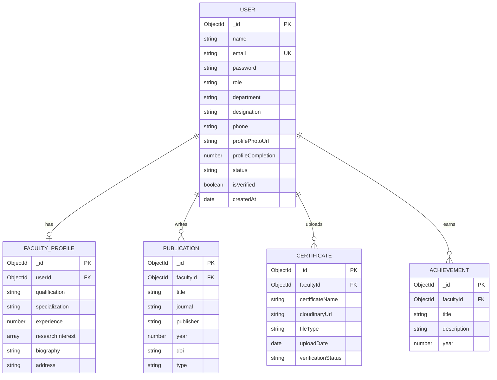

# ER Diagram

```mermaid
erDiagram
    USER ||--o| FACULTY_PROFILE : has
    USER ||--o{ PUBLICATION : writes
    USER ||--o{ CERTIFICATE : uploads
    USER ||--o{ ACHIEVEMENT : earns

    USER {
        ObjectId _id PK
        string name
        string email UK
        string password
        string role
        string department
        string designation
        string phone
        string profilePhotoUrl
        number profileCompletion
        string status
        boolean isVerified
        date createdAt
    }

    FACULTY_PROFILE {
        ObjectId _id PK
        ObjectId userId FK
        string qualification
        string specialization
        number experience
        array researchInterest
        string biography
        string address
    }

    PUBLICATION {
        ObjectId _id PK
        ObjectId facultyId FK
        string title
        string journal
        string publisher
        number year
        string doi
        string type
    }

    CERTIFICATE {
        ObjectId _id PK
        ObjectId facultyId FK
        string certificateName
        string cloudinaryUrl
        string fileType
        date uploadDate
        string verificationStatus
    }

    ACHIEVEMENT {
        ObjectId _id PK
        ObjectId facultyId FK
        string title
        string description
        number year
    }
```
