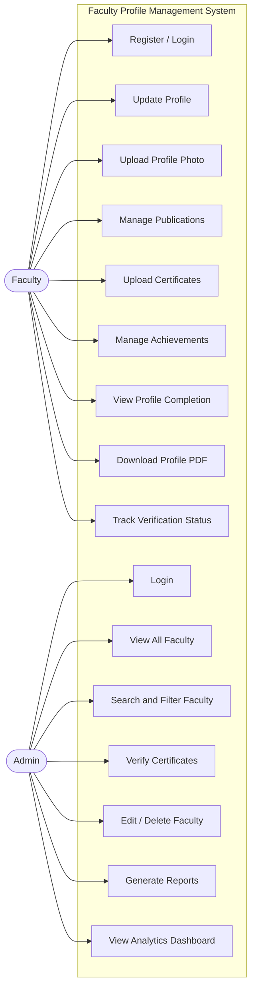

# Use Case Diagram

```mermaid
flowchart LR
    Faculty([Faculty])
    Admin([Admin])

    subgraph System["Faculty Profile Management System"]
        UC1[Register / Login]
        UC2[Update Profile]
        UC3[Upload Profile Photo]
        UC4[Manage Publications]
        UC5[Upload Certificates]
        UC6[Manage Achievements]
        UC7[View Profile Completion]
        UC8[Download Profile PDF]
        UC9[Track Verification Status]

        UC10[Login]
        UC11[View All Faculty]
        UC12[Search and Filter Faculty]
        UC13[Verify Certificates]
        UC14[Edit / Delete Faculty]
        UC15[Generate Reports]
        UC16[View Analytics Dashboard]
    end

    Faculty --> UC1
    Faculty --> UC2
    Faculty --> UC3
    Faculty --> UC4
    Faculty --> UC5
    Faculty --> UC6
    Faculty --> UC7
    Faculty --> UC8
    Faculty --> UC9

    Admin --> UC10
    Admin --> UC11
    Admin --> UC12
    Admin --> UC13
    Admin --> UC14
    Admin --> UC15
    Admin --> UC16
```
